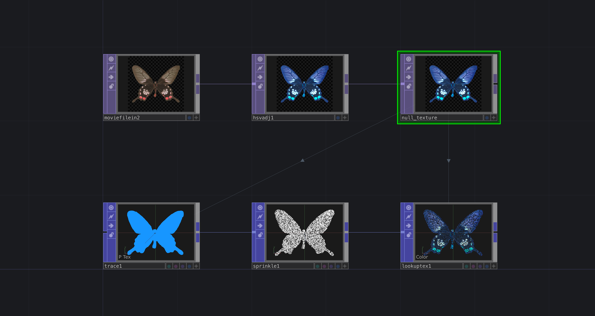
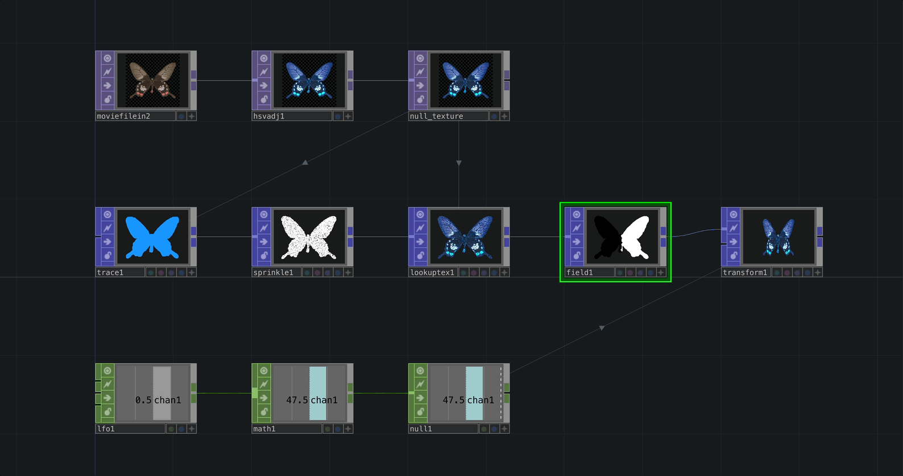
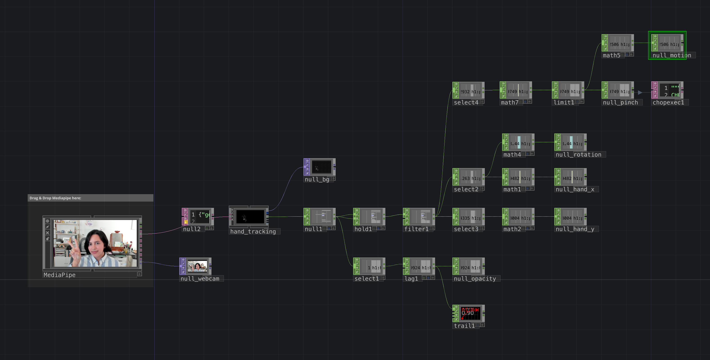

# TouchDesigner Workshop USC 2026

## TouchDesigner Version

* Workshop TouchDesigner version - 2025.32460
  * [downloads page](https://derivative.ca/download)

# Workshop Overview

This short 2-hour workshop will give an introduction to TouchDesigner via a crash-course in network building, working with different operator families, and exploring realtime inputs via the [TouchDesigner Mediapipe plugin](https://github.com/torinmb/mediapipe-touchdesigner).

During the workshop we'll create everything together so you have the hands on experience of building networks yourself. While that's great for working in the moment, sometimes you want (or need) an extra reference. This repo contains all of the exercises we've gone over together in the workshop, along with additional examples to learn more of the fundamentals of TouchDesigner.

The first time you open any new application it can be frustrating or confusing as you try to understand how the interface works. TouchDesigner is a node based toolkit, and while it's similar to many tools, it's also distinctly unique. We'll take a little time to cover the basics of getting around the environment, and how to understand what we're seeing. Before you know it you'll be zooming around your networks like it's second nature.

> Half of learning a new tool or development environment is just figuring out where all the knobs and buttons are. In this first course we’ll focus on getting your bearings in TouchDesigner, learning the essential interface elements and controls, as well as the fundamental principles of each operator family.

Learn more at [Navigating the TouchDesigner Environment](https://learn.derivative.ca/courses/100-fundamentals/lessons/101-navigating-the-environment/)

## Operator Families

Operators are the building blocks of our TouchDesigner networks. In a typically TouchDesigner project you'll find a series of operators connected by wires into a network. These networks make up the code for your project. The operators in our networks are separated into families which also represent that kinds of data that they contain.

### TOPs

> A picture’s worth a thousand words… in TouchDesigner we work with images all the time, and the texture operator family is our primary means of manipulating pixels. From importing files to building visual FX this course will look at how we work with images and video, and how we can manipulate them in TouchDesigner.

Learn more at [Working with TOPs](https://learn.derivative.ca/courses/100-fundamentals/lessons/102-tops-working-with-images/)

### CHOPs

> Channel operators (CHOPs) are the signals and controls that bring a TouchDesigner project to life. CHOPs bring in controls from outside devices, allow us to work with Audio, build simple state machines, and animate elements in the network. This course will cover the principal aspects of the channel operator family, as well as examine use cases and mechanics that will help you build your first interactive project.

Learn more at [Working with CHOPs](https://learn.derivative.ca/courses/100-fundamentals/lessons/103-chops-working-with-signals/)

### SOPs

> With a long history in authoring 3D worlds and figures, TouchDesigner’s roots reach back to principles of non-destructive procedural geometry authoring. Surface Operators (SOPs) are the geometric and modeling primitives in the TouchDesigner environment; they’re also our introduction to the world of real time rendering and open a world of opportunities for creating both artistic and technical visual worlds

Learn more at [Working with SOPs](https://learn.derivative.ca/courses/100-fundamentals/lessons/104-sops-rendering-3d-scenes/)

### DATs

> Text, tables, and scripts – a little bit of Python can go a long way; from controlling how operators function in the network, to more complex state and preset machines. While it’s not required that you learn Python to use TouchDesigner, it does open a wide world of possibilities for expanding your projects and creativity. In this course we’ll dip our toe into the scripting waters while also learning about the flexibility and power of the text based operators in TouchDesigner.

Learn more at [Working with DATs](https://learn.derivative.ca/courses/100-fundamentals/lessons/107-dats-scripting-python/)

### COMPs

> Making something visually compelling only half the story, it’s also important to consider how you paint the world with the pixels you’ve manipulated. In this course we’ll look at the essential organization and output mechanics for displaying your work on a screen or through a projector. We’ll also look some the high level organizational capabilities in TouchDesigner, and how this can make your projects easier to navigate.

Learn more at [Working with COMPs - Network Organization](https://learn.derivative.ca/courses/100-fundamentals/lessons/105-comps-interfaces-organization-outputs/)

> In addition to building aesthetically focused elements, TouchDesigner is also used to author full UI packages for applications, exhibition pieces, and installations. In this lesson, we’ll look at the building blocks for creating interactive user interfaces, as well as how to build resolution adaptable elements.

Learn more at [Working with COMPs - Building Interfaces](https://learn.derivative.ca/courses/100-fundamentals/lessons/106-comps-interface-building-and-controls/)

## Interactivity & Using Channel Data

### Connecting Families

While it’s great to see how we connect operators of like families together, most of the work we do with TouchDesigner often requires connecting operators of different families together. We’ll look at simple examples of how we can start building relationships between operators of different families, and how we can use these ideas to build responsive and interactive networks.

### TouchDesigner MediaPipe Plugin

We'll also take a look at how we can work with [TouchDesigner Mediapipe plugin](https://github.com/torinmb/mediapipe-touchdesigner) in our projects: from downloading it from the main repo, optimizing for project performance, smoothing and manipulating sensor data, to simple techniques for realtime hand-tracking.

## Realtime Rendering

We'll pull all of our elements together to render them in a simple scene that overlays a butterfly on our webcam, and shows how we can transform the butterfly into a swirl of noisey magic. 

> Real time rendering in TouchDesigner requires a few primary ingredients. These are made up of both Component Operators, Texture Operators, and Surface Operators. Our most basic set-up starts with a [Light](https://docs.derivative.ca/Light_COMP), [Camera](https://docs.derivative.ca/Camera_COMP), and [Geometry COMP](https://docs.derivative.ca/Geometry_COMP). Component operators can hold entire networks, and the Geometry COMP typically holds the SOPs we plan on rendering. In order to actually render our scene we need to add a [Render TOP](https://docs.derivative.ca/Render_TOP) to our network. The Render TOP uses the Light, Camera, and Geo COMPs to create a 2D view of our 3D scene.

Learn more at [TouchDesigner Basic Render Setup](https://learn.derivative.ca/courses/100-fundamentals/lessons/104-sops-rendering-3d-scenes/topic/basic-render-setup/)

----

# Resources

* [Learn TouchDesigner from Derivative]
* [The Interactive & Immersive HQ]
* [TouchOSC]
* [OSC]
* [Visual Studio Code]
* [Derivative Blog]
* [ TouchDesigner MediaPipe Plugin]

<!-- links -->

[TouchOSC]:https://hexler.net/touchoscO
[OSC]:https://opensoundcontrol.stanford.edu/
[Learn TouchDesigner from Derivative]: https://learn.derivative.ca/
[The Interactive & Immersive HQ]:https://interactiveimmersive.io/
[System Requirements]: https://docs.derivative.ca/index.php?title=System_Requirements
[TouchDesigner 099]: https://derivative.ca/download
[Derivative Registration]: https://derivative.ca/user/register
[Visual Studio Code]: https://code.visualstudio.com/
[Derivative Blog]: https://derivative.ca/showcase
[TouchDesigner MediaPipe Plugin]: https://github.com/torinmb/mediapipe-touchdesigner
